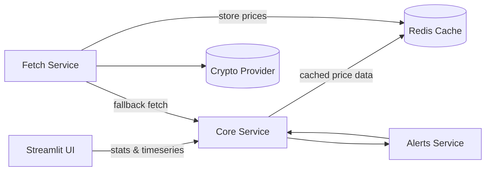

## Introduction
CryptoLens began as a small personal project: I simply wanted a clean, minimal, white-themed dashboard to monitor a few cryptocurrencies. No noisy UI, no bloated charts, just real data and meaningful risk metrics.

As the idea grew, so did the architecture. Instead of a single monolithic backend, the project evolved into a microservice-based system with fetching, analytics, alerting, and a polished UI. In this blog, I walk through the entire process — the design, the challenges, and the lessons learned.

github repo: [Link](https://github.com/liyouqi/crpyto-lens.git)
---

## Motivation
Most online crypto dashboards are either overly complex or visually cluttered. I wanted something different:

- Lightweight  
- Modular  
- Easy to extend  
- Easy to break and fix  
- Aesthetic enough that I’d actually enjoy using it  

Microservices were a natural fit: each component handles a single responsibility, which made debugging and iterating much easier.

---

## System Architecture

The final structure looks like this:



Each service communicates through Docker Compose internal networking.
---

## Why  Redis Caching is Critical Here

1. To avoid hammering external APIs  
Real‑world price APIs throttle fast. Redis protects against this.

2. To ensure consistent data across services  
If fetch-service retrieved values at timestamp X, core-service sees exactly the same data.

3. To make everything faster  
Redis access is microseconds. This matters for real‑time dashboards.

4. To support multiple UI users  
If several users access the dashboard, Redis ensures zero extra API load.

---


## Components

#### 1. Fetch Service
Responsible for fetching historical price data from an external crypto API.  
One unexpected bug was timestamp inconsistencies — some providers return milliseconds, others seconds.  
Normalizing them solved several downstream issues.

#### 2. Core Service
This is the analytics engine. It computes:

- Average price  
- Max/min  
- Change percentage  
- Volatility  
- Drawdown  
- Sharpe ratio  
- Downside risk  
- Annualized volatility  

These metrics give the system a real quantitative feel.

#### 3. Alerts Service
A small but meaningful module that evaluates:

- Sudden price drops  
- Volatility spikes  
- Significant drawdowns  

Alerts are categorized into:
- OK  
- Warning  
- Alert  

#### 4. UI — Streamlit Dashboard
I aimed for a calm, clean, white UI — something I can check daily without fatigue.


Key features:
- KPI metrics  
- Line charts  
- Alert badges  
- Cross-symbol correlation  

---

## Docker Compose — The Major Gotcha

The entire system runs on Docker Compose, which orchestrates the services.


---

## Development Challenges & Notes

#### 1. Streamlit Layout
Mixing custom HTML `<div>` cards with the `columns()` layout caused strange alignment issues.  
Eventually I dropped the custom CSS cards and switched to `st.metric()` — cleaner and perfectly aligned.

#### 2. Data Normalization
Handling timestamps was crucial to avoid broken charts.

#### 3. Layer-by-Layer Debugging
I solved issues in this order:
UI → Fetch → Core → Alerts → Integration  
This approach saved a lot of time.


#### Handling timestamp inconsistencies
I had to detect ms vs. seconds and normalize:

```python
if ts > 1e12:
    dt = pd.to_datetime(ts, unit="ms")
else:
    dt = pd.to_datetime(ts, unit="s")
```
---

## Final Result

- A clean crypto monitoring dashboard  
- Quantitative metrics  
- Real-time data  
- Automatic alerts  
- Modular services  

It’s simple but real — and most importantly, extensible.

---

## Future Extensions
I plan to add:
- Multi-exchange support  
- Live WebSocket streaming  
- ML-based forecasts  
- Custom user-defined alerts  
- Time-series database integration  
- Portfolio risk analysis  

---

## Closing Thoughts
CryptoLens is just a starting point, we can build so much more on this foundation.

  
