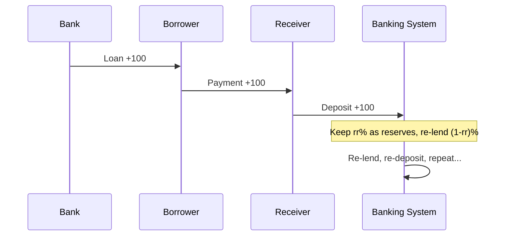
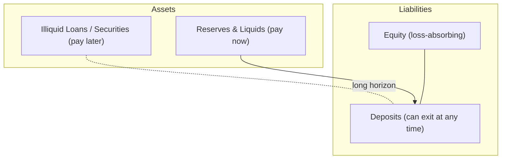
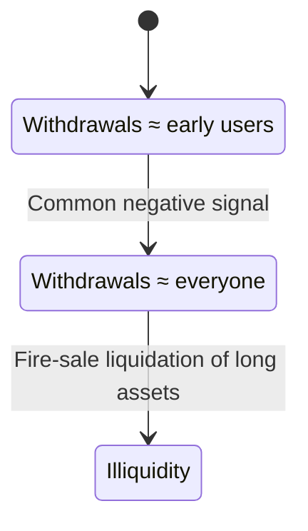
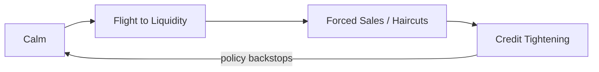

**PDF source:** [Diamond–Dybvig teaching note (download)](/assets/books/diamond-dybvig.pdf)

This article traces a simple path from **what counts as money** to **why banks can both insure and break**. It introduces monetary aggregates (M0/M1/M2/M3), sketches how loans create deposits, and then connects those mechanics to the Diamond–Dybvig logic on liquidity creation and bank runs. The aim is clarity and coherence, in the register of a master’s-level study note: careful definitions, minimal jargon, and math only when it illuminates an idea.

---

## 1) What is money? (M0 → M1 → M2 → M3)

Money is layered. Each higher layer trades immediacy for yield.

- M0: physical currency in circulation (notes and coins).
- M1: M0 plus demand deposits (checking/current accounts; instantly spendable).
- M2: M1 plus savings deposits and short-term time deposits (less liquid, slightly higher yield).
- M3: M2 plus larger or longer-term deposits and selected marketable instruments (definitions vary by jurisdiction).


Intuition: the further one moves from M0, the more an instrument looks like a claim on money rather than money itself. Payment habits and institutional setups determine which layer feels “real” in daily life.

---

## 2) Where new money shows up (loans create deposits)

A classic reserve-ratio story is useful for intuition even if modern practice is richer.

**Simple fable** (closed system, fixed reserve ratio rr, no currency drain):

we denoted **rr** as the required reserve ratio.

1. A bank grants a loan of 100.  
2. The borrower spends; the receiver deposits the 100.  
3. The banking system keeps rr×100 as reserves and re-lends the remainder.  
4. Iterating, total deposits approach 100 × (1/rr).



Example: Presume a person takes a 1000 loan, and rr = 10% (0.1). The banking system can create up to 10,000 in deposits through repeated lending and depositing. Then, the money multiplier is:
$$
\text{Money Multiplier} = \frac{1}{rr} = \frac{1}{0.1} = 10
$$


**Modern lens (endogenous money)**: well-capitalized banks extend credit to creditworthy borrowers, creating a matching deposit now and securing funding or reserves afterward. Central banks accommodate reserves to keep the policy rate near target. The “multiplier” then reflects policy, balance-sheet constraints, and demand for credit—not a mechanical lever.

---

## 3) A bank’s balance sheet is a timing machine

Banks bridge assets that pay later with deposits that can leave now. That timing service is the essence of intermediation.



A healthy bank holds enough reserves and liquid assets to meet normal outflows and a cushion for stress. The remainder is placed in longer-dated assets to earn a spread. The spread pays for the timing service.

---

## 4) Why the timing service is fragile (the coordination wrinkle)

If beliefs are calm, only those who need cash early withdraw; others wait and receive a higher payoff later. If a negative common signal convinces many that others will rush, they will rush too. Long assets must then be liquidated at a discount, validating the fear.



The same promise that insures timing risk also opens a coordination door.

---

## 5) Liquidity as insurance: the contract logic

In the Diamond–Dybvig setup, people do not know if they will need to consume early or late. A deposit contract pools them and offers two payoffs:

- Early users receive r₁ (liquid but modest).  
- Late users receive r₂ (illiquid but higher), financed by leaving funds invested when early consumption is not required.

Let t be the expected early-withdrawal share and R the date‑2 gross return on the illiquid asset. Planning for t, a bank can deliver

 

$$
r_2 = \frac{(1 - t\, r_1) R}{1 - t}
$$

$$
U'(r_1) = R\,U'(r_2)
$$

With risk-averse preferences, the optimal pair (r₁, r₂) equalizes marginal utility across time:

$$
U'(r_1) = R\,U'(r_2)
$$


Meaning: the bank manufactures liquidity insurance—cushioning those who end up early while rewarding patience for the rest. Pooling makes this feasible in a way individuals cannot replicate on their own.

> One can view the bank as holding a small “inventory” of liquid assets sized to the expected early share t, with the remainder in long assets earning R. The contract shares that benefit across types.

---

## 6) When the good outcome coexists with a bad one

The model admits two self-consistent outcomes:

- Good equilibrium: beliefs are calm; only early users withdraw; late users wait for r₂ > r₁.  
- Run equilibrium: beliefs anticipate a rush; everyone withdraws; long assets are liquidated; waiting ceases to be rational.

This is about coordination, not necessarily solvency, which is why a rumor or a visible queue can be enough to start a stampede.

Two stabilizers target this margin:

- Suspension of convertibility: pause withdrawals once they exceed the planned early share t. The threat makes “wait” credible again, but real suspensions are politically costly when genuine early needs exceed t.  
- Deposit insurance: a credible fiscal backstop promises to honor the contract even under a rush, removing the bad equilibrium. It trades coordination risk for incentive issues, so supervision remains essential.

Both tools repair beliefs so the timing machine can keep working.

---

## 7) Aggregates and runs in one picture

Why discuss M1/M2/M3 here? Because runs reshuffle which layer of money people trust most.

- In calm states, M1 (deposits) is “money enough”; banks can hold modest reserves and more long assets, lifting r₂ for patient users.  
- Under stress, agents try to move up the liquidity ladder (from M3 → M2 → M1 → currency). That flight pressures asset sales, shrinks credit, and tightens the very liquidity everyone seeks.



Backstops—lender of last resort and guarantees—break the loop by converting private timing problems into public balance-sheet capacity.

---

## 8) Simulation Results

The first figure shows how panic beliefs can spread within a few iterations once expectations cross a critical threshold.  
The second figure plots the relationship between system stability and confidence: a tiny increase in trust can prevent a total collapse — a classic feature of the Diamond–Dybvig framework.


---

## Notes and reference

This article synthesizes standard monetary definitions with the liquidity‑creation and run logic in Diamond–Dybvig. Equations, symbols, and contract intuition draw on the teaching exposition you provided (Diamond & Dybvig materials), adapted into a continuous narrative suitable for a study note.


### Appendix: Code for the simulation figures

### Appendix — complete script 

Tell me you have some interest insights

```python

import numpy as np
import matplotlib.pyplot as plt

# --- Parameters ---
N = 1000
t = 0.3
R = 1.5
L = 0.9
belief_run_base = 0.2    # baseline panic threshold
insurance_boost = 0.15   # how much deposit insurance raises confidence
init_fear = 0.02         # initial belief that others may run (2%)

# --- Belief dynamics function ---
def simulate_beliefs(threshold):
    early = np.random.rand(N) < t
    belief = np.random.rand(N) < init_fear
    history = []
    for _ in range(10):
        run_share = belief.mean()
        history.append(run_share)
        if run_share >= threshold:
            belief[:] = True
        else:
            belief = np.where(early, True, belief)
    return history

# --- Run both cases ---
history_no_ins = simulate_beliefs(belief_run_base)
history_ins = simulate_beliefs(belief_run_base + insurance_boost)

# --- Plot side-by-side ---
fig, axes = plt.subplots(1, 2, figsize=(10,4), sharey=True)

# No insurance
axes[0].plot(range(len(history_no_ins)), history_no_ins, marker='o', color='tab:blue')
axes[0].axhline(belief_run_base, color='r', linestyle='--', label='Run threshold')
axes[0].set_title('Without Deposit Insurance')
axes[0].set_xlabel('Iteration')
axes[0].set_ylabel('Share expecting a run')
axes[0].legend()

# With insurance
axes[1].plot(range(len(history_ins)), history_ins, marker='o', color='tab:green')
axes[1].axhline(belief_run_base + insurance_boost, color='r', linestyle='--', label='Run threshold')
axes[1].set_title('With Deposit Insurance')
axes[1].set_xlabel('Iteration')
axes[1].legend()

plt.suptitle('Belief Dynamics in a Bank Run Simulation')
plt.tight_layout()
plt.savefig('bank_run_simulation.png')
plt.show()

# --- Plot 2: stability vs belief threshold ---
belief_thresholds = np.linspace(0.05, 0.5, 10)
final_runs = []

for bthr in belief_thresholds:
    early = np.random.rand(N) < t
    belief = np.random.rand(N) < 0.02
    for _ in range(5):
        if belief.mean() >= bthr:
            belief[:] = True
        else:
            belief = np.where(early, True, belief)
    final_runs.append(belief.mean())

plt.figure(figsize=(6,4))
plt.plot(belief_thresholds, final_runs, marker='o')
plt.title('Stability vs. Belief Threshold')
plt.xlabel('Belief threshold for run')
plt.ylabel('Final withdrawal share')
plt.tight_layout()
plt.savefig('stability_vs_threshold.png')
plt.show()


```