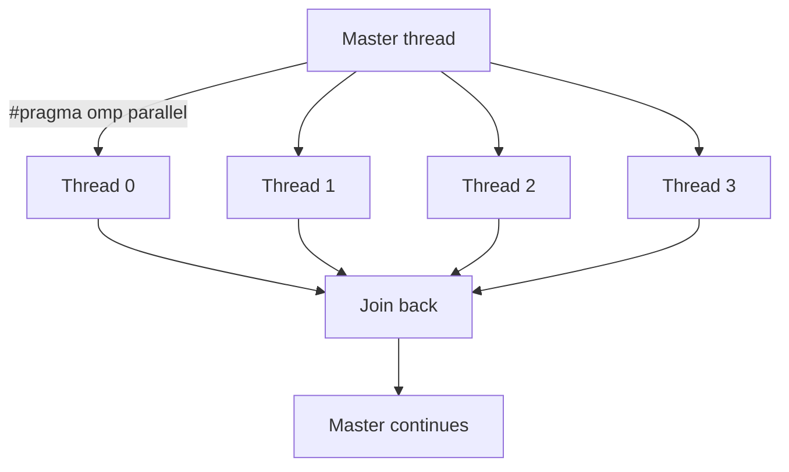

I’ve been setting up a tiny OpenMP “Hello, World” to make sure my toolchain is honest with me. Nothing fancy—just enough to see multiple threads come alive and to feel the fork–join rhythm. Notes below are the exact steps and the mental model I keep in my pocket.

## Why start here
- Just a tradition, eveything starts with “Hello, World.”

## The fork–join picture (rendered with Mermaid)



## Minimal example in C language 
_File: `hello_omp.c`_
```c
#include <stdio.h>
#include <omp.h>

int main(void) {
    // Optionally set threads in code (or use OMP_NUM_THREADS)
    // omp_set_num_threads(4);

    // A parallel region: a team of threads runs this block
    #pragma omp parallel
    {
        int tid = omp_get_thread_num();    // thread id: 0..nthreads-1
        int nthreads = omp_get_num_threads(); // team size inside region
        // Keep it as a single printf to reduce interleaving
        printf("Hello from thread %d of %d\n", tid, nthreads);
    } // implicit barrier here; threads join the master

    return 0;
}
```

## What’s happening line by line
- `#include <omp.h>` brings in the OpenMP runtime API: `omp_get_thread_num`, `omp_get_num_threads`, `omp_set_num_threads`, etc.  
- `#pragma omp parallel` is a compile-time directive that **forks** a team at runtime. Each thread executes the block.  
- `omp_get_thread_num()` returns the logical id of the calling thread; order is not guaranteed.  
- `omp_get_num_threads()` returns the team size (inside a parallel region).  
- Printing in parallel is inherently racy—expect scrambled lines unless you synchronize.

## Build & run
### GCC / Clang (Linux/macOS)
```bash
# build
gcc -O2 -fopenmp hello_omp.c -o hello_omp

# run (A): control threads via environment
export OMP_NUM_THREADS=4
./hello_omp

# run (B): set threads in code with omp_set_num_threads(4); then
./hello_omp
```

### Windows
- MinGW: same `-fopenmp` flag.  
- MSVC (Visual Studio): enable OpenMP in project settings (`/openmp`).

> Expected output (order varies by run):
```
Hello from thread 2 of 4
Hello from thread 0 of 4
Hello from thread 3 of 4
Hello from thread 1 of 4
```

## Controlling thread count (and optional binding)
- Prefer the environment for experiments:
```bash
export OMP_NUM_THREADS=1
export OMP_NUM_THREADS=2
export OMP_NUM_THREADS=4
export OMP_NUM_THREADS=8
```
- Or set it programmatically **before** entering a parallel region: `omp_set_num_threads(k)`  
- Optional affinity (varies by runtime): `OMP_PROC_BIND=close`, `OMP_PLACES=cores`

## A tiny reproducible check
This loop is my quick self-test to see the team size respond to the environment:

```bash
for t in 1 2 4 8; do
  export OMP_NUM_THREADS=$t
  echo "---- OMP_NUM_THREADS=$t ----"
  ./hello_omp | sort   # sorting only for readability; remove to see real interleaving
done
```

If `nthreads` doesn’t change, your environment or container might be constraining visible cores.

## If I want tidy output (teaching-only tricks)
**Critical section** — serializes the print (adds overhead, useful for demos):
```c
#pragma omp parallel
{
    int tid = omp_get_thread_num();
    int n = omp_get_num_threads();
    #pragma omp critical
    {
        printf("Hello from thread %d of %d\n", tid, n);
    }
}
```

**Ordered-by-id print** — forces a sequence using barriers (don’t do this in real work):
```c
#pragma omp parallel
{
    int tid = omp_get_thread_num();
    int n = omp_get_num_threads();
    #pragma omp barrier
    for (int k = 0; k < n; ++k) {
        #pragma omp barrier
        if (tid == k) printf("Hello from thread %d of %d\n", tid, n);
        #pragma omp barrier
    }
}
```

## Notes from the field
- Forgetting `-fopenmp` is the classic trap; the code runs, but it’s effectively serial.  
- Output order is not a bug; it’s a signal. Parallel work is concurrent by nature.  
- Set thread counts *before* you open the region; changing it inside won’t do anything.  
- High optimization levels can erase what looks like “dead” work—keep a side effect (prints or timers) while exploring.

## Closing thought
This small program is not about speed; it’s about **contact**—touching the thread runtime, seeing the messy edges, and getting comfortable. From here, the next post will slice an integral into pieces and ask the team to cooperate (and disagree) over shared state.
