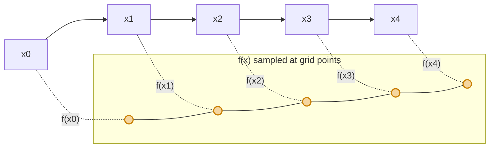

> _“High performance computing is a perfect tool to accelerate numerical methods, but getting the parallel patterns right can be tricky. In this post, I explore two common OpenMP approaches to parallelizing the trapezoidal rule for numerical integration.”_

In this post I’ll walk through how I implemented the trapezoidal rule for numerical integration in C, and then parallelized it using **OpenMP** in two different ways:

1. `parallel + for + critical`
2. `parallel for + reduction`

They both compute the same mathematical thing, but the way they use threads — and the performance implications — are quite different.  

I’ll try to keep it simple.

---

## 1. The problem: approximate a definite integral

The basic numerical analysis problem is:

$$
I = \int_a^b f(x)\, dx
$$

We want a numerical approximation of this integral. To keep the example simple (and testable), I’ll use:

$$
f(x) = x^2,\quad a = 0,\quad b = 1
$$

The nice thing about this choice is that we know the exact answer:

$$
\int_0^1 x^2 dx = \left[\frac{x^3}{3}\right]_0^1 = \frac{1}{3} \approx 0.3333333333\ldots
$$

So later, when we print the result of our program, we can directly see if it looks reasonable or not.

---

## 2. Recap: the trapezoidal rule

Let’s briefly recall what the trapezoidal rule is doing.  
I always like to picture it geometrically first.


### 2.1 Slicing the interval

We split the interval $[a, b]$ into $n$ subintervals of equal width:

$$
h = \frac{b - a}{n}
$$

This gives us the grid points:

$$
x_0 = a,\quad x_1 = a + h,\quad x_2 = a + 2h,\ \ldots,\ x_n = a + nh = b
$$

  
At each $x_i$, we evaluate the function $f(x_i)$.


### 2.2 A single trapezoid

On each small subinterval $[x_i, x_{i+1}]$, we **approximate the curve** by a straight line between $(x_i, f(x_i))$ and $(x_{i+1}, f(x_{i+1}))$.

This forms a trapezoid with:

- height (base in the x‑direction): $h$
- two parallel sides (in the y‑direction): $f(x_i)$ and $f(x_{i+1})$

The area of this trapezoid is:

$$
\text{Area}_i = \frac{h}{2} \big( f(x_i) + f(x_{i+1}) \big)
$$

### 2.3 Summing all trapezoids

Now we just add up all these small trapezoids:

$$
I \approx \sum_{i=0}^{n-1} \frac{h}{2}\,\big(f(x_i) + f(x_{i+1})\big)
$$

If you expand and regroup terms, you get the classic “endpoints once, middle points twice” formula:

$$
I \approx \frac{h}{2} \left[ f(x_0) + 2 f(x_1) + 2 f(x_2) + \cdots + 2 f(x_{n-1}) + f(x_n) \right].
$$

In the form that is most convenient for coding:

$$
I \approx h\left( \frac{f(x_0) + f(x_n)}{2} + \sum_{i=1}^{n-1} f(x_i) \right).
$$

That last line is almost a direct translation into C: compute the two endpoints once, sum all the middle points, and multiply by $h$.

---

## 3. Visual intuition: trapezoids under the curve

Here’s a simple diagram to visualize what’s going on.  



The idea is:

- More slices (larger $n$) → trapezoids become thinner → approximation improves.
- For our OpenMP experiments, we’ll typically pick a large $n$ (like 1,000,000) so that there is enough work to see the benefit of parallelism.

---

## 4. Baseline: a serial implementation in C

Before doing anything with OpenMP, I always like to write a clean serial version.  
This is both a correctness reference and a performance baseline.

```c
#include <stdio.h>

double f(double x) {
    return x * x;   // Example function: f(x) = x^2
}

int main() {
    double a = 0.0;
    double b = 1.0;
    int n = 1000000;   // number of subintervals

    double h = (b - a) / n;
    double sum = 0.0;

    // Endpoint contribution: (f(a) + f(b)) / 2
    sum += (f(a) + f(b)) / 2.0;

    // Sum over interior points: i = 1 .. n-1
    for (int i = 1; i < n; i++) {
        double x = a + i * h;
        sum += f(x);
    }

    double result = h * sum;

    printf("Integral (serial) = %.15f\n", result);
    return 0;
}
```

Expected output (roughly):

```text
Integral (serial) = 0.333333333333xxx
```

If that number is too far from 1/3, something is wrong.

---

## 5. First parallel version: `parallel + for + critical`

Now we start using **OpenMP**.

The critical part of our serial code is the loop:

```c
for (int i = 1; i < n; i++) {
    double x = a + i * h;
    sum += f(x);
}
```

The good news: each iteration is independent (no dependence on other `i`).  
The bad news: all iterations update the **same** variable `sum`.

So the plan is:

1. Let each thread have its own **local accumulator** `local_sum`.
2. Use `#pragma omp for` to split the iterations among threads.
3. After a thread is done with its iterations, it enters a **critical region** to safely add `local_sum` to the shared `sum`.

### 5.1 Why not just do `sum += f(x)` in parallel?

Because that would look like this:

```c
#pragma omp parallel for
for (int i = 1; i < n; i++) {
    double x = a + i * h;
    sum += f(x);   // <-- dangerous!
}
```

Multiple threads would try to update `sum` at the same time → **race condition**.  
You might see weird results or non‑deterministic behavior.

So we really want to separate:

- independent computation (`local_sum += f(x);`)
- shared update (`sum += local_sum;`) protected with `critical`

### 5.2 Code: trapezoidal rule with `parallel + for + critical`

Here is the full version using OpenMP in this style:

```c
#include <stdio.h>
#include <omp.h>

double f(double x) {
    return x * x;   // Example: f(x) = x^2
}

int main() {
    double a = 0.0;
    double b = 1.0;
    int n = 1000000;

    double h = (b - a) / n;
    double sum = 0.0;

    // Endpoint contribution: (f(a) + f(b)) / 2
    sum += (f(a) + f(b)) / 2.0;

    // Parallel region
    #pragma omp parallel
    {
        double local_sum = 0.0;  // Each thread has its own local sum

        // Distribute the loop iterations among threads
        #pragma omp for
        for (int i = 1; i < n; i++) {
            double x = a + i * h;
            local_sum += f(x);
        }

        // Safely accumulate into the shared sum
        #pragma omp critical
        {
            sum += local_sum;
        }
    } // end of parallel region

    double result = h * sum;

    printf("Integral (parallel + critical) = %.15f\n", result);
    return 0;
}
```

If you run this with different thread counts, you should see roughly the same numerical result as the serial version, but potentially less runtime when `n` is large and your CPU has multiple cores.

For example:

```bash
gcc -fopenmp trap_critical.c -o trap_critical

OMP_NUM_THREADS=1 ./trap_critical
OMP_NUM_THREADS=4 ./trap_critical
OMP_NUM_THREADS=8 ./trap_critical
```

---

## 6. Second parallel version: `parallel for + reduction`

The `parallel + critical` version is explicit and educational, but a bit verbose and not always the most efficient. OpenMP actually provides a very convenient mechanism for exactly this pattern: **reduction**.

The idea of `reduction(+:sum)` is:

- Each thread maintains its own private copy of `sum` internally.
- The compiler/runtime handles the “local sum + final combine” logic.
- At the end of the parallel region, all the private sums are **combined** with the specified operator (`+` in this case).

In other words, this:

```c
double sum = 0.0;

#pragma omp parallel for reduction(+:sum)
for (int i = 1; i < n; i++) {
    double x = a + i * h;
    sum += f(x);
}
```

is conceptually equivalent to:

- having per‑thread `local_sum`
- accumulating locally
- and combining them at the end

but without us manually writing `local_sum` and `critical`.

### 6.1 Code: trapezoidal rule with `parallel for + reduction`

Here is the same trapezoidal rule, but using reduction instead of `critical`:

```c
#include <stdio.h>
#include <omp.h>

double f(double x) {
    return x * x;   // Example: f(x) = x^2
}

int main() {
    double a = 0.0;
    double b = 1.0;
    int n = 1000000;

    double h = (b - a) / n;
    double sum = 0.0;

    // Endpoint contribution (done once, outside the parallel region)
    sum += (f(a) + f(b)) / 2.0;

    // Parallelized loop with reduction on sum
    #pragma omp parallel for reduction(+:sum)
    for (int i = 1; i < n; i++) {
        double x = a + i * h;
        sum += f(x);
    }

    double result = h * sum;

    printf("Integral (parallel + reduction) = %.15f\n", result);
    return 0;
}
```

Again, compile and run:

```bash
gcc -fopenmp trap_reduction.c -o trap_reduction

OMP_NUM_THREADS=1 ./trap_reduction
OMP_NUM_THREADS=4 ./trap_reduction
OMP_NUM_THREADS=8 ./trap_reduction
```

You should see:

- The same numerical result (up to small floating‑point differences).
- Often slightly better performance compared to the `critical` version, especially as you increase the number of threads.

---

## 7. Comparing the two OpenMP approaches

Now let’s put the two styles side by side and compare them.

### 7.1 Code structure

**`parallel + for + critical`**

- More manual code:
  - declare `local_sum`
  - write a `critical` section by hand
- Good for learning:
  - makes it very obvious that each thread has its own local accumulator
  - helps understand race conditions    

**`parallel for + reduction`**

- More concise:
  - no explicit `local_sum`
  - no `critical`
- Clear intent:
  - `reduction(+:sum)` immediately tells the reader “this is a parallel sum”

### 7.2 Performance considerations

A very rough summary:

| Aspect                     | `parallel + critical`                     | `parallel for + reduction`                         |
|----------------------------|-------------------------------------------|----------------------------------------------------|
| Synchronization overhead   | Potentially high (threads queue on `critical`) | Generally lower; combine happens more efficiently |
| Code verbosity             | More verbose                              | More compact                                       |
| Educational value          | Great for understanding race conditions   | Great for writing real code                        |
| Typical speed on many cores| Can become a bottleneck at large thread counts | Usually scales better                              |

In the `parallel + critical` version, all threads eventually have to pass through the same `critical` section to update `sum`. With many threads, this can become a bottleneck: threads may block and wait for each other.

In the `reduction` version, the combining of partial sums is structured more efficiently (often in a tree‑like fashion under the hood).

### 7.3 Numerical results

Both approaches should produce almost the same value as the serial version. If you want to be a bit more “numerical‑analysis nerdy”, you can:

- print the absolute error vs. the true value $1/3$
- compare `serial`, `critical`, and `reduction` in a small table

For example (fill in with your actual measurements):

| Version                 | Threads | Result           | Absolute Error $|I - 1/3|$ | Time (ms) |
|-------------------------|--------:|-----------------:|-----------------------------:|----------:|
| Serial                  | 1       | 0.33333333xxxxx | …                           | …         |
| Parallel + critical     | 4       | 0.33333333xxxxx | …                           | …         |
| Parallel + reduction    | 4       | 0.33333333xxxxx | …                           | …         |

You can then add screenshots from your terminal or cluster job output below this table in your blog.

---

## 8. Running on a cluster (optional section)

If run this on a cluster that uses **Slurm**, a minimal job script might look like this:

```bash
#!/bin/bash
#SBATCH --job-name=omp_trap
#SBATCH --cpus-per-task=8
#SBATCH --time=00:02:00

export OMP_NUM_THREADS=$SLURM_CPUS_PER_TASK

./trap_critical
./trap_reduction
```

Submit with:

```bash
sbatch run_trap.sh
```

#TODO : Paste the output screenshot from the cluster here.

---

## 9. Summary and takeaways

Let me quickly recap what we did in this combined post:

1. **Mathematics**  
   - Reviewed the trapezoidal rule:
     - derived the formula from basic geometry of trapezoids
     - used $f(x) = x^2$ on $[0, 1]$ as a test case with a known exact answer
2. **Serial implementation**  
   - Wrote a clean C version as our baseline
3. **OpenMP with `parallel + for + critical`**  
   - introduced `local_sum` per thread  
   - used `#pragma omp for` to distribute loop iterations  
   - used `#pragma omp critical` to safely accumulate into `sum`
4. **OpenMP with `parallel for + reduction`**  
   - simplified the pattern using `reduction(+:sum)`  
   - kept the same mathematical algorithm but with cleaner parallel code


Happy parallelizing
