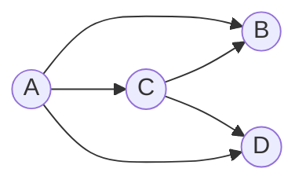

I posted something I cared about. Three likes.  
Meanwhile a friend’s timeline reads like a live stream.  
If this sounds familiar, here’s a gentle thought: it might not be “me vs. the world”—it might be the shape of the network and how our feeds are built on top of it.

Today I gonna explore this a little bit, inspired by a lecture from my professor.

> _Motto_: **Build to wonder.**

---

## The feeling vs. the structure

In any social graph, popular people show up more often in everyone’s local view. That’s not a vibe; it’s a structural bias. The classic name is **Friendship Paradox**: _on average, your friends have more friends than you_. So my feed naturally skews toward the loud and well-connected, even before algorithms add their seasoning.

Now bring in recommendation systems. They learn from engagement (who saw, liked, shared) and from the graph itself (who connects to whom). This doesn’t just reflect the bias—it often **amplifies** it. Popularity compounds into visibility; visibility compounds into more popularity. Not always, but often enough to feel like a rule.

Apparently, this is not a fate. It’s just an effect to understand and design around.

---

## From a whiteboard to an adjacency matrix (what my teacher sketched)

I like starting from a concrete graph. Here’s the one my teacher drew; I re-created it below so we can reason about it without abstraction.

### Mini graph 




**Edge list**

$$
E=\{(A,B), (A,C), (A,D), (C,B), (C,D)\}, \quad |E|=5
$$

There are 4 nodes, so a directed $$4\times4$$ adjacency grid has 16 cells (if self-loops were allowed). Only 5 of those cells are “1”. 

### Adjacency matrix $$M$$

> Convention: **row = from**, **column = to**.

|     | A | B | C | D |
|:---:|:-:|:-:|:-:|:-:|
| **A** | 0 | 1 | 1 | 1 |
| **B** | 0 | 0 | 0 | 0 |
| **C** | 0 | 1 | 0 | 1 |
| **D** | 0 | 0 | 0 | 0 |

- **Out-degree** (row sum): A=3, B=0, C=2, D=0  
- **In-degree** (col sum): A=0, B=2, C=1, D=2  
- **Density** (no self-loops): 
  $$
  |E|/(n(n-1))=5/12\approx 0.417
  $$

### Two-step paths with $$M^2$$

Matrix multiplication here counts fixed-length paths.

$$
M^2 = M \cdot M
$$

|     | A | B | C | D |
|:---:|:-:|:-:|:-:|:-:|
| **A** | 0 | **1** | 0 | **1** |
| **B** | 0 | 0 | 0 | 0 |
| **C** | 0 | 0 | 0 | 0 |
| **D** | 0 | 0 | 0 | 0 |

From **A**, there are exactly two two-hop routes: $$A\to C\to B$$ and $$A\to C\to D$$.  
$$M^3$$ is all zeros here (B and D are sinks), so this little graph is a **DAG**—you run out of road quickly.

> **Pocket memory**  
> Copy edges → fill matrix (row i, col j) with 1 for $$i\to j$$.  
> Row sums = out-degree; column sums = in-degree.  
> Want exact k-step paths? Multiply $$M$$ by itself $$k$$ times.


```
A --> B
| \    \
|  \    \
v   v    v
C --> D  (C -> B, C -> D)

Edges: (A,B), (A,C), (A,D), (C,B), (C,D)
```

---

## Friendship Paradox in one line

Seen from local neighborhoods, the average friend degree is

$$
E[k_f] = \frac{E[k^2]}{E[k]} \;>\; E[k].
$$


Plain English: when the degree distribution has a heavy tail, the “friends” you bump into are biased toward the well-connected. That’s why your feed feels star-heavy. Algorithms that weight engagement and influence lean into this bias unless they deliberately resist it.

---

## A tiny, reproducible experiment

Nothing heavyweight—just a small simulation to _see_ the bias. You can run this locally.

> **Environment**: `networkx`, `numpy`, `matplotlib`  
> `pip install networkx numpy matplotlib`

```python
import random, numpy as np, networkx as nx
import matplotlib.pyplot as plt

np.random.seed(42); random.seed(42)

# A small "social-like" network: Barabási–Albert (scale-free-ish)
n, m = 2000, 5
G = nx.barabasi_albert_graph(n, m)

nodes = list(G.nodes())
degrees = np.array([G.degree(v) for v in nodes], dtype=float)
friend_avg_deg = np.array([
    np.mean([G.degree(u) for u in G.neighbors(v)]) if G.degree(v) > 0 else np.nan
    for v in nodes
], dtype=float)

print(f"Mean degree: {np.nanmean(degrees):.2f}")
print(f"Friends' mean degree: {np.nanmean(friend_avg_deg):.2f}")

# Fig 1: overlaid histograms
plt.figure(figsize=(8,5))
plt.hist(degrees, bins=40, alpha=0.6, label='Node degree')
plt.hist(friend_avg_deg[~np.isnan(friend_avg_deg)], bins=40, alpha=0.6, label="Friends' avg degree")
plt.xlabel("Degree"); plt.ylabel("Frequency")
plt.title("Node vs Friends' average degree")
plt.legend(); plt.tight_layout()
plt.show()

# Fig 2: scatter with y=x
plt.figure(figsize=(8,5))
plt.scatter(degrees, friend_avg_deg, s=8, alpha=0.5)
lim = float(np.nanmax([degrees.max(), friend_avg_deg.max()]))
plt.plot([0, lim], [0, lim], linewidth=1)
plt.xlabel("Node degree"); plt.ylabel("Friends' average degree")
plt.title("Scatter with y = x reference")
plt.xlim(0, lim); plt.ylim(0, lim); plt.tight_layout()
plt.show()
```


Reading the plots:

- **Histogram**: the “friends’ average degree” curve sits to the right—more high-degree nodes in view.  
- **Scatter**: most points live above the $$y=x$$ line—your friends are, on average, more connected than you.

If you want to _turn the effect up_, change `m` from 5 → 8 (heavier tail).  
Want something milder? Try a small-world model instead of scale-free:

```python
G = nx.watts_strogatz_graph(n=2000, k=10, p=0.1)
```

---

## Edges, not destinies (a small closing note)

A few places where the effect softens:

- **Narrow tails**: small, fairly even groups.  
- **Deliberate diversity**: platforms that budget exposure for small/new accounts.  
- **Closed communities**: tight language or geography fences.

So the paradox isn’t a doom scroll—just a default. Knowing the default helps me design around it and create on my own terms.

- BTW
I have another similar post on Six Degrees of Separation: [link here](). But it is more about global structure than local bias.
Friendship Paradox is about a local sampling bias, while Six Degrees of Separation is about global distance properties. 

