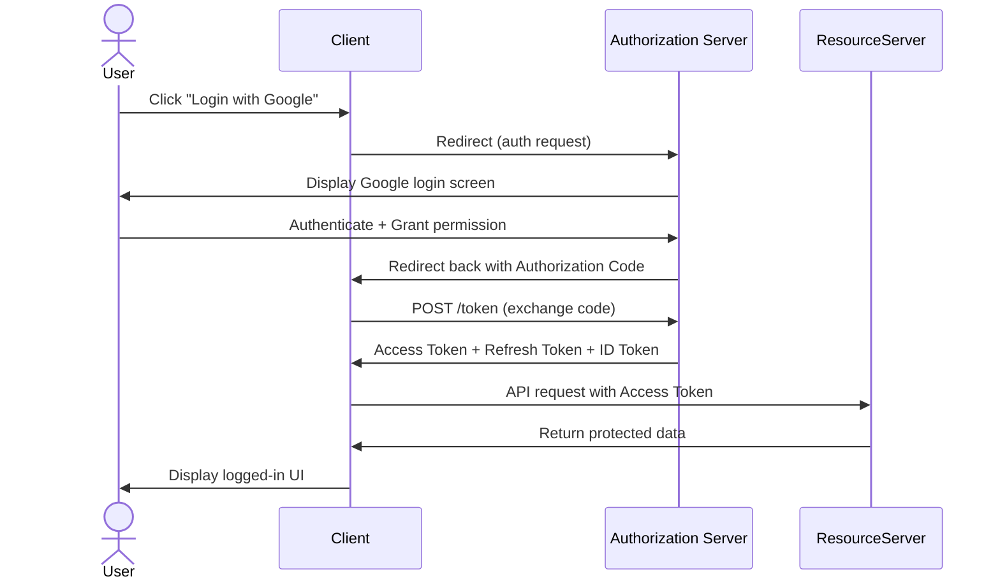

Today, I have a class on Service-Oriented Architecture, a team presented on OAuth 2.0. Just some basic demo and flow diagrams, but it reminded me of how far I've dived into authentication mechanisms over the years. I barely remember these things when I first started coding web apps and the technology always evolves. From simple API keys to OAuth 1.0a, then OAuth 2.0, and now OpenID Connect and beyond. I experienced so many iterations of auth flows, tokennn handling, and some others. Besides, security practices also changed a lot and mobile apps has different needs. That's all? Definitely not. Interms of end-point, we will find more complex scenarios like microservices, serverless functions, Iot devices, etc. There are so many factors to consider when I was designing an authentication system for a company or a product. 

Now I am on my gap year, it's a good time to reflect on what I have done in the past and share some thoughts. So, it is not just about OAuth2.0. I will talk about some just following my memmory.

##   1. Why Choosing the Right Authentication Method Matters

In almost every modern application, authentication is not merely a technical requirement — it is the *gateway* that shapes your system’s security posture, user experience, scalability, and long-term maintainability. Whether you are building a personal blog platform, a back-office admin system, a mobile app backend, or an enterprise-grade internal service, the authentication strategy you choose will influence:

No doubt, authentication is the first line of defense against unauthorized access. It is the gateway that shapes your system’s security posture. But not only that:
- **User Experience**: The ease of use and convenience of the authentication process directly impact user. That's relly annoy when user have to deal with clunky login flows or frequent re-authentication.
- **Scalability**: As your application grows, the authentication mechanism must scale seamlessly. A poorly designed auth system can become a bottleneck. I was involved in a project using single application in the first place, but later with the expension of services, we have to migrate to microservices architecture. The auth system need to be re-designed to support distributed services. Of course, no one can blame it since we have to facing the fact that public the first version in only one month. That's pretty common in a China's company, make it work first and fast, then iterate.
- **Maintainability**: A well-architected system simplifies future updates. Sometimes, we can see companies stuck with legacy auth systems that are hard to update or replace. I remember one of my brother team was using a custom-built authentication system that was difficult to maintain and update. They eventually had to migrate to a more standard solution, which was a significant undertaking.
- **Compliance**: Depending on your industry. For B2B applications, for customers, or for internal use, even the same application has different compliance requirements, like iOS and Android apps have different rules on data privacy and user consent. 

I am going to discuss four main authentication approaches that I have worked or collaborated with over the years:

- **Custom-built authentication (Session or JWT-based)**  
- **Ruoyi's JWT approach (JWT + Redis hybrid model)**  
- **OAuth 2.0 (third-party authorization)**  
- **SAML SSO (enterprise single sign-on)**  

These solutions do not compete with each other — they solve different problems and excel in different environments. I just want to share my experience and insights on when and why to choose each approach.

## 2. Understanding：OAuth 2.0
#### 2.1 The Foundation of Modern Third-Party Authorization

Why I said foundation? Because OAuth 2.0 is not an authentication protocol, but an authorization framework. It allows third-party applications to obtain limited access to user resources without exposing user credentials. OAuth 2.0 has become the de facto standard for third-party authorization.

OAuth 2.0 is widely adopted, let us dive into its core principles.

> **How can a third-party application access a user’s resources without asking for the user’s password?**

Before OAuth existed, third-party apps had to store and use user passwords directly. This created serious problems:
- Password reuse across services  
- Risk of credential leaks  
- No fine-grained permissions (apps had full access)  
- Impossible to revoke access without changing your password  

Can you remember you need remember facebook, blog, twitter, youtube, etc passwords separately? Or you just use the same password everywhere? That's a bad practice but so many people do that, me as well.

OAuth solved this by introducing a system where:
- The third-party app never learns the user’s credentials  
- The user can grant precise, limited permissions  
- Access can be revoked at any time  
- Tokens replace passwords in API calls  

At its core, OAuth 2.0 revolves around a simple idea:

> **Users should authorize apps using tokens—not passwords.**

This shift has made OAuth the backbone of modern internet authentication flows (Google, Facebook, GitHub, Apple, Microsoft), mobile app login, and almost all API integrations.

In the following part, we will explore OAuth’s architecture, security model, token system, and—most importantly—its real-world applicability compared with other authentication methods.

#### 2.2. OAuth Architecture & Why It Works the Way It Works

Back when I first learned OAuth, I treated it like some kind of “Login Protocol 2.0”.  
But after actually implementing it in a real project — handling redirects, token exchange, silent refresh, revoking tokens — I realized OAuth itself doesn’t care who you are at all.

It only cares about what you are allowed to do.

That’s the difference between authentication (AuthN) and authorization (AuthZ).  
OAuth only solves **authorization**.  
If you want authentication, you need OpenID Connect stacked on top of it.

I didn’t understand that earlier. Nobody in my team understood that either.  
We were using OAuth to do login, and we thought we were geniuses.  

To really understand OAuth, you have to understand the four actors.  
Once you get this mental model right, everything becomes obvious.

#### **2.3 The Four Actors**
- **User / Resource Owner** – the person whose data we want to access  
- **Client** – your app, which wants access  
- **Authorization Server** – the “police officer” that checks if the user agrees  
- **Resource Server** – the actual API that holds the data  

In real life:

| Example | Role |
|--------|------|
| You | User |
| Your App | Client |
| Google Accounts | Authorization Server |
| Google Calendar API | Resource Server |

They talk to each other. A lot. And the best way to understand that is a sequence diagram — not the boring waterfall ones, but something that actually shows interaction.

OAuth 2.0 is basically the compromise between usability and security after years of iteration.

#### 2.4 The Token Trio

Three main token tpyes:

Access Token

Refresh Token

ID Token

But most beginners don’t know they come from different layers.

Token	Comes From	Purpose
Access Token	OAuth 2.0	Call API
Refresh Token	OAuth 2.0	Get new Access Token
ID Token	OpenID Connect	Verify user identity

The funny part is:
Most engineers (including my past self) think ID Token is part of OAuth.
It’s not. OIDC is just glued on top of OAuth.

OAuth alone does NOT give you “who the user is”.
So if you try to build your login system only with OAuth, you're missing a piece.

You can still make it work,
but the right way is OIDC + OAuth
(And yes, “Login with Google” is doing exactly that.)

#TODO： To be continued...