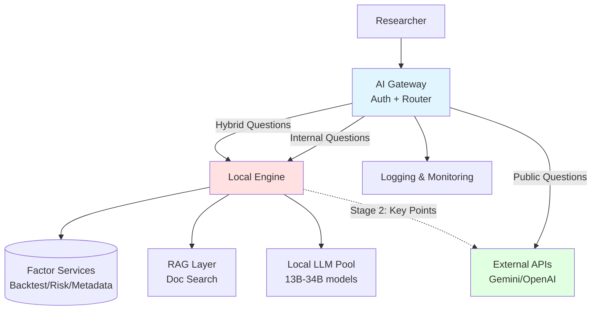

> A draft on building AI systems for internal factor research scenarios

---

## 1. The initial

Picture a financial institution that already has solid quant infrastructure in place. They've got their own factor library, market data warehouse, and backtesting system. Researchers spend their days checking factor performance, tuning parameters, writing reports.

Management wants to add an AI layer. But the ask isn't just "build us a chatbot." It's more specific. They want researchers to query factors in plain language, like "Why has this value factor underperformed over the past two years?" They want AI to summarize complex backtest results and factor performance into something readable for upstream teams, downstream users, or clients. And they want help with writing factor-related code and documentation, but without breaking existing risk controls and compliance guardrails.

In this context, a simple question surfaces pretty quickly:

> If we hand all this to external API models, compliance won't approve it.  
> But if we lock everything down and rely only on local small models, the quality just won't be there.

This piece tries to sketch out a practical answer from an architecture perspective. How do you build a dual-engine AI system (API models + Local LLM) inside a finance company — one that doesn't shy away from what big external models can do, but also doesn't hand over the keys to your data?

---

## 2. Let's Split the Problem Space First

In day-to-day factor research, the questions researchers ask roughly fall into three buckets.

First, there are questions purely about internal data. Things like "How has our proprietary value factor's IC performed over the past 12 months?" or "What's the impact of this recent drawdown on our multi-factor portfolio's style exposure?" The answers come entirely from internal databases and internal docs. There's no need for external knowledge, and definitely shouldn't leave the network.

Second, pure public knowledge questions. "Explain the basic idea behind the Fama-French three-factor model" or "Give me a Python/pandas snippet to calculate rolling IC by trading day." Here, the data isn't the point — it's more about academic concepts and coding.

Third, hybrid questions that sit in between. "Based on our value factor's performance over the past year, write a summary for clients. Keep it slightly optimistic" or "Summarize this backtest result and pull out the strengths and risks of this long-short portfolio."

From a systems design standpoint, these three types shouldn't all get tossed to the same model using the same logic. But from the researcher's perspective, they'd ideally all go through one entry point — a unified AI panel or interface.

In actual usage, the distribution probably looks something like this. Pure internal questions make up 60-70% — factor performance queries, backtest interpretation, portfolio diagnostics. This is the high-frequency, everyday stuff for researchers. Pure public questions are around 15-20% — literature lookups, writing generic code, explaining academic concepts. Hybrid questions take the remaining 15-20% — client reports, strategy highlights, risk disclosure documents.

If you try to solve this with a single model, you run into problems. Go all external API and 60% of your high-frequency questions go over the network — compliance and risk control will never sign off on that. Go all local small models and public knowledge and writing tasks will be noticeably weaker than GPT-4/Gemini-level models. Researchers will try it a few times and give up. Make it manual choice every time and you're offloading the "which model to use" burden onto users. Terrible experience. It'll end up collecting dust.

This is the basic motivation for a "dual-engine" setup. Two types of models under the hood, one entry point on top, and the system decides which path to take based on clear strategies. The key isn't "having two models" — it's having a stable, interpretable routing logic.

---

## 3. The Overall Shape of the Dual-Engine Architecture

Let me sketch out a relatively complete structure first, then we'll dig into the key paths.

There's a lot going on here, but it boils down to two layers. One door on top handles unified entry, auth, routing, and policy decisions. Two types of engines below do the actual work: one stays close to factors and internal data running on the local network, while the other connects to external APIs for general-purpose tasks.

The sections below won't just list features — I'll walk through a few typical paths to explain why split it this way.

---

## 4. Path One: Pure Internal Factor Questions

Let's look at the cleanest case first:

> "How has our proprietary value factor performed in A-shares over the past year? Write me an explanation covering main contributions and risk sources."

Requests like this usually come from the frontend with some structured info attached — factor_id, market, time range, etc.  
On the AI hub side, it roughly goes through these steps:

### Step 1: Gateway figures out "what kind of question is this"

From an implementation perspective, it's just a simple classification in the Gateway. It figures out this is a "factor explanation" type question, it references an internal factor_id, and the user is a researcher with permission to access that factor.

This step doesn't need a fancy model — rules plus some light text classification is enough. The goal is to give the policy engine a clear label, not treat every request like "random chat."

### Step 2: Policy engine routes it straight to the "local-only" track

For this type of question, the policy is simple. Data domain is `internal_factor` or `portfolio`, default to "must be handled locally," external routing blocked.

If you write this into policy config, you don't need "if/else" logic scattered through your code. It clearly tells the system this type of question is non-negotiable — local path only.

### Step 3: Figure out "what happened" first, then "how to explain it"

The real information content comes from factor services, not the LLM.

On the local side, a few things happen. Query the backtest and performance service for that factor's metrics over the specified time range: IC, IR, annualized excess return, drawdown, etc. Query the risk service for style factor and sector exposure. Query factor metadata and doc library: definition, construction method, past research conclusions.

If you have a clean factor API, this step is just a few HTTP or RPC calls. The RAG layer pulls these together: some are structured numbers, some are text snippets from docs.

### Step 4: Local LLM does "explanation," not "making up conclusions"

At this point, the local LLM receives not an empty question, but a rich package of context. Historical performance data for the factor. Relevant doc snippets. Maybe an "output requirement," like word count or tone.

The ask for the LLM isn't "figure out what happened on your own," but rather:

> Based on this data, help me organize an explanation my colleagues can read. Don't introduce conclusions that aren't in the data or docs.

Under this constraint, even if the local model isn't super powerful, it's more like doing "translation and organization" rather than "creative inspiration."

### Trade-offs in Local Model Selection

You don't need specific benchmark numbers, but you can reason through a few key trade-offs.

Model size versus concurrency. Say the company has 50 researchers, peak might be 10-15 concurrent requests. If you pick a 70B parameter model, even quantized, single-GPU inference speed will struggle with that load. But if you go with a 7B model, you can run multiple instances, but its ability to understand complex financial terms and long docs is noticeably weaker. A relatively balanced choice is the 13B-34B range. Basic understanding of financial domain terms and logic. Quantized to 4-bit, a single GPU can run 2-3 instances. Even without fine-tuning, reaches usable levels for "organizing with clear context" tasks.

General model versus finance domain model. If there's an open-source "finance LLM" out there (like open alternatives to BloombergGPT), should you definitely use it? Not necessarily. In this architecture, the local model's job isn't "answering finance questions" — it's "organizing information that's already been retrieved." General models (like LLaMA series) often have stronger language organization capabilities, while the advantages of domain models (recognizing technical terms, knowing industry common sense) are actually "replaced" here by the RAG layer and factor services. Unless there's clear evidence that a domain model also excels at "text organization" tasks, a general model might be the more pragmatic choice.

Open-source versus commercial closed-source small models. Some cloud vendors offer "privately deployable small models" that work better than certain open-source models but charge per token or require licensing. The trade-off here is if this AI system is just "nice to have," use open-source to save costs. If it's already a daily tool for researchers with thousands of calls per day, investing more in model quality is worth it.

External APIs don't get a chance in this path. For finance companies, this path handles the most sensitive yet also most frequent type of question. Keeping it locked to local is a pretty natural choice.

---

## 5. Path Two: Pure Public Questions — Just Use the API

The other extreme is questions like "Explain the Fama-French three-factor model" or "Write me a pandas snippet to calculate rolling IC by trading day" or "Help me write an English summary of a hedge fund strategy."

These questions don't depend on internal data — they're typical "general knowledge + coding + writing." If you force local small models to handle them, the quality is clearly worse, and you're also wasting the paid external APIs you already have access to.

At the architecture level, the path for these is much simpler. Gateway sees the request doesn't carry internal identifiers (no factor_id, portfolio ID, account info, etc.). Policy engine checks the current tenant or business unit's config, confirms external models are allowed. Routes the request directly to some API adapter (like Gemini or OpenAI), which handles the actual API call and error handling.

You can add a baseline check here. Even for "public questions," do a lightweight sanitization and filtering on the input first. For example, check if there are table names, database names, paths that shouldn't appear in external requests, to prevent the frontend from being stuffed with unexpected content.

From a user experience perspective, the researcher probably doesn't even realize which model they're using. For them, it's just "asked a question in the sidebar panel, got what looks like a solid answer."

---

## 6. Path Three: The "Two-Stage" Approach for Hybrid Questions

The trickiest are the in-between questions, like:

> "Based on our factor's performance over the past year, write a summary we can send to clients. Keep it slightly optimistic."

It's got an internal factor ID, mentions "clients," and adds a tone requirement like "slightly optimistic."

If you do it all locally,  
you can have the local LLM generate a summary based on internal data,  
but the language style usually ends up stiff and sounds like "system-generated output."

If you toss it all to external API,  
you either send factor data out raw, or let the model make up an "optimistic story" — both are uncomfortable.

The dual-engine design can do a middle-ground split here:

### Stage One: Organize "key points list" on the internal network

Still go through the local path, first pull together numbers, conclusions, and risk points related to the factor's performance into a fairly structured "key points list." Something like: excess contribution to the portfolio over the past year was roughly X%, main returns came from the financials and consumer discretionary sectors, largest drawdown happened in a certain month mainly tied to a market style rotation, current exposure leans toward value and small-mid cap, risks to flag for clients include A, B, C.

This part stays entirely on the internal network. Structured info comes from factor services, text parts can be generated by the local LLM or pretty rigid templates. The key is this list isn't directly for external presentation — it's an intermediate product.

### Stage Two: Only send "abstracted key points" to the external model for language packaging

Next, the system only sends this key points list and a simple audience description (like "target readers are institutional clients") plus tone requirements to the external API:

> Here's a set of key points about a factor's recent performance. Without adding new facts, help me write a ~300-word summary in a slightly optimistic but not over-promising tone for a client brief.

At this step, the external model doesn't see specific positions, portfolio IDs, backtest details — only the deliberately abstracted descriptive layer info you've extracted. Its job also shifts from "judging good or bad" to "telling these points smoothly."

By splitting it this way, the two models each do what they're better suited for. Local model and factor services handle the qualitative and quantitative "figuring out what happened." External model handles packaging already-screened and abstracted facts into externally friendly, appropriately toned text.

### Why "Two-Stage" Beats Other Approaches

Worth expanding on a few alternative approaches and their issues.

Approach A would be having the local model do everything. In theory, you could fine-tune a local model to learn "how to write client reports in a professional but friendly tone." But the practical challenges are real. High-quality "client report" samples are hard to get in bulk (compliance approval involved, can't just use as training data). Even after fine-tuning, 7B-13B scale models are still noticeably weaker than GPT-4 level in language fluency and style control. More critically, once fine-tuning locks in a writing style, if business requirements shift later (like from "optimistic" to "neutral"), you'd have to retrain.

Approach B would be anonymizing factor data then sending it all to external models. Some might think "I'll fuzz out specific factor names and position details, just tell the external model 'a value-type factor performed this way,' isn't that fine?" The problem is how much anonymization. If you scrub too hard (just say "performed well"), the external model's output is generic fluff. If you keep IC curves, sector exposure, drawdown timing — anyone with experience can reverse-engineer strategy characteristics. Finance companies' compliance and risk control typically won't accept "we anonymized the data so it's okay to send out" logic.

Approach C would be having the external model generate a draft, then heavy manual rewriting. This is actually what a lot of companies do now, but essentially it's treating AI as an "inspiration tool" rather than a "productivity tool." Researchers still have to rewrite most of it themselves, so why not have the system split out what can be automated (fact organization) from what needs human judgment (final draft)?

Compared to these, the two-stage approach has advantages. Clear responsibilities: internal network handles "facts that can't be wrong," external network handles "expression that can be adjusted." Controllable risk: even if the external model talks nonsense, it only sees abstract key points — worst case is "phrasing it badly," not fabricating data that doesn't exist. High flexibility: swap to a different API vendor or adjust output style — just change stage two's prompt, doesn't affect stage one's fact extraction logic.

From a finance company's perspective, this "play to each side's strengths" split is more stable than any extreme approach.

---

## 7. Strategy & Routing: Writing the "Sense of Boundaries" Into the System

The three paths above might sound like three stories, but in the system, they're just different combinations of routing rules.

A fairly practical approach is to tag each request with a few simple labels. Data domain could be `public`, `internal_doc`, `factor`, `portfolio`, and so on. Task type might be `factor_explain`, `doc_summary`, `code_assist`, `writing`, etc. User and system config would track whether external models are allowed, monthly quota, that kind of thing.

The router doesn't need to be super "smart" — just read these tags, then look up a few hard rules in the policy system. If data domain is in the factor or portfolio set AND task type is factor explanation or performance review, it must go local path. If data domain is public AND task type is code assist, general Q&A, or writing AND current tenant allows external, it can go external API directly. If data domain is factor AND task type is client summary (those hybrid questions), go local path first to produce "key points list," then external model for language packaging.

### When the Router "Can't Tell"

In real use, you'll inevitably hit some edge cases with fuzzy boundaries, like:

> "How does our factor compare to the HML factor in Fama-French?"

This question involves both internal factor (needs internal data) and academic knowledge (Fama-French is public theory). If the router can't decide whether it's "pure internal" or "hybrid," a conservative approach would be to default to the strictest path and treat it as an "internal question," only using local model and internal docs. You could also give the user a choice by adding a line like "If you need a more detailed academic comparison, click here to switch to external model" in the response. And the system should separately flag requests where "router wasn't sure," to inform future policy rule optimization.

Another type of issue is fallback strategies. If external API is down (vendor outage or quota exhausted), what happens to those "pure public questions"? You can set a backup API (if Gemini is down, switch to OpenAI), or temporarily downgrade to local model but clearly tell the user "currently using backup model, answer quality may be lower."

If local model service is overloaded (too many concurrent requests), do you queue or partially downgrade to external API? For "pure internal questions," you can only queue or reject — can't send data out just to go faster. For "hybrid questions," you could consider skipping the local "fact organization" step, have the user manually input key points, then hand off to external model for packaging.

If you write these rules as config or policy files, you get a few benefits. Compliance and risk control can read it, know where the system's "boundary lines" are drawn. In the future, if you swap API vendors or move certain tasks from external back to local, you just change the policy — no need to overhaul the whole system. If something goes wrong, you can trace back: why did this request go to external model, who configured it, was it normal routing or fallback?

This layer is actually the most critical piece of the dual-engine architecture. It's not about "using two models," it's about "having a stable, interpretable, degradable decision logic in the system."

---

## 8. Governance Layer — Quick Note

Finance scenarios can't escape governance. Just touching on two points.

First is auditing.  
Each request should leave at least a few types of info: who initiated it, which path it took, which data domains it accessed, which model it used (local or which API), whether there was a fallback or rollback.  
These logs aren't just for troubleshooting — they're the foundation for explaining "what the AI system is actually doing" to compliance and risk control later.

Second is usage and cost control.  
External API calls should be metered separately by tenant, department, business line.  
Local LLM should have rough resource usage stats.  
Once any dimension hits a preset threshold, it can trigger policy adjustments: for example, after monthly external quota runs out, auto-downgrade to "local model only + notify user."

Dual-engine isn't just a tech problem — it's also a budgeting and balancing problem.  
The governance layer exists to keep this architecture running under real-world constraints, not just as a one-off demo.

---

## 9. Zooming Out on the Architecture Choice

From a technical standpoint, "API + Local LLM dual-engine architecture" can get drawn into a lot of complex diagrams and stacked with buzzwords. But in a finance company context, the problem is actually pretty straightforward. Sensitive data that should stay on the internal network — keep it there. Tasks where external models are clearly better — don't force local models to fake it. Questions in the middle — split into "fact judgment" and "language organization" stages, hand each to the more suitable side. Write these choices into clear, auditable policies — not just "what some developer feels like."

### Why Not Just Wait for the "Perfect Local Model" to Show Up

Someone might ask: since external models are so strong, why not just wait for the open-source community to release "a local model as strong as GPT-4," then move everything back local? Wouldn't that avoid all this hassle?

The problem with this thinking comes down to three things. Time cost: it took over a year to go from GPT-3.5 to GPT-4, then over a year more for open-source models to catch up to GPT-3.5. This gap might always exist, because the training resources for frontier models aren't something normal companies can replicate. Task differences: even if one day local models catch up on benchmarks, the "fine-tuning data" finance companies actually need (client reports, internal research) is hard to gather at scale. That bottleneck won't disappear just because the base model gets stronger. Cost structure: if you self-build a GPU cluster capable of supporting GPT-4-level inference just for "complete localization," that cost might be way higher than "handing 20% of public tasks to API."

The essence of dual-engine architecture is acknowledging "no single model is optimal across all dimensions," then designing a system that lets different models play to their strengths where they excel.

### Where This Architecture Fits (and Where It Doesn't)

Worth noting, this design isn't a "silver bullet" — it has pretty clear use cases.

Good fit when the company already has fairly complete data and business systems (factor library, backtest platform, etc.) and AI is an added layer on top. When researcher questions have reasonably clear categories (internal versus public versus hybrid), not completely random. When management can accept "some tasks use external API" as a premise, not demanding 100% self-sufficiency.

Bad fit when the company's core requirement is "absolutely no data can leave the network" — then it's all local and dual-engine is pointless. When question types are super scattered (asking about factors today, macro tomorrow, option pricing the day after) and routing strategy gets absurdly complex — better to just give users two buttons and let them choose. When the team doesn't have the capacity to maintain local LLM inference services (GPUs, model updates, prompt tuning) — you're better off just using API for everything, at least it's low-maintenance.

## 10. If You Were Actually Going to Build This, Where to Start

This doc so far is more like an "architecture white paper," but if you really wanted to push for implementation, I'd suggest starting with these things:

### Step 1: Confirm the Real Distribution of the Three Question Types

Find 5-10 researchers, have them log all questions they ask over a week (or just analyze existing ticketing systems or internal forum history).  
See if the actual split of "pure internal / pure public / hybrid" matches expectations.  
If you find 90% are pure internal questions, you might not need dual-engine at all — just nail local RAG and call it a day.

### Step 2: Validate Whether "Two-Stage" Actually Works, in the Simplest Way Possible

Don't build out the full system. Start with a minimum validation. Manually pull factor performance data from the factor service. Have a local model (can even simulate with API at first) organize it into a "key points list." Hand that list to GPT-4, have it write a client report. Show it to people in the business unit and ask "if this flow were automated, would you use it?"

If the feedback at this step is "key points list isn't accurate enough" or "the final report still needs major rewrites," that means the assumptions for this path have issues and need adjusting.

### Step 3: Write Policy Rules First, Code Later

Before you start coding, write out the routing policy as a doc or config file. What kinds of requests must go local? What kinds can go external? What kinds need to be split into two stages? What happens in fuzzy edge cases? How do you fall back if one side goes down?

Show this doc to people from compliance, risk control, and business units. Get their input. The goal of this step isn't to "get them to approve a tech plan" — it's to get everyone on the same page about the system's behavioral boundaries. A lot of AI projects end up stuck in compliance because the tech team thinks "it's good enough," but the compliance team has no idea under what conditions the system will send data out.

### Step 4: Small Pilot, Collect Real Feedback

Find 3-5 researchers willing to try it out, give them an internal beta access point. Don't chase "perfect experience" right out of the gate — focus on observing. What questions do they actually ask? How accurate is the router's judgment? Which answers do they find "useful" versus "not worth it, might as well look it up myself"? Are there cases where "the system misunderstood what type of question this is"?

At this stage, the system can be "a bit slow" and "a bit clunky," but it can't be "not sure what it's doing." If even internal testers can't figure out "where did this answer come from" or "why did it use external model this time," that means the interpretability isn't there yet.

---

With that framing, "API + Local LLM dual-engine architecture"  
isn't about chasing a buzzword — it's a relatively pragmatic middle ground:  
You don't give up the efficiency big external models bring researchers, but you also don't casually hand over factor and trading data to someone else.

With clear policy boundaries and a small-steps, trial-and-error rhythm,  
down the line, whether you're swapping models, fine-tuning, adding new task types, you've got a fairly clear skeleton to attach things to,  
instead of starting every discussion from "which model should we even use?"
