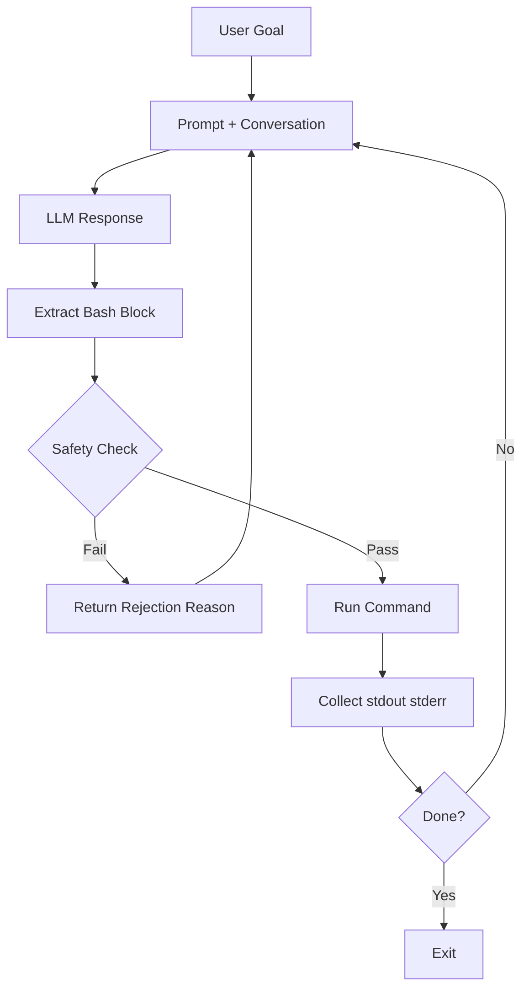
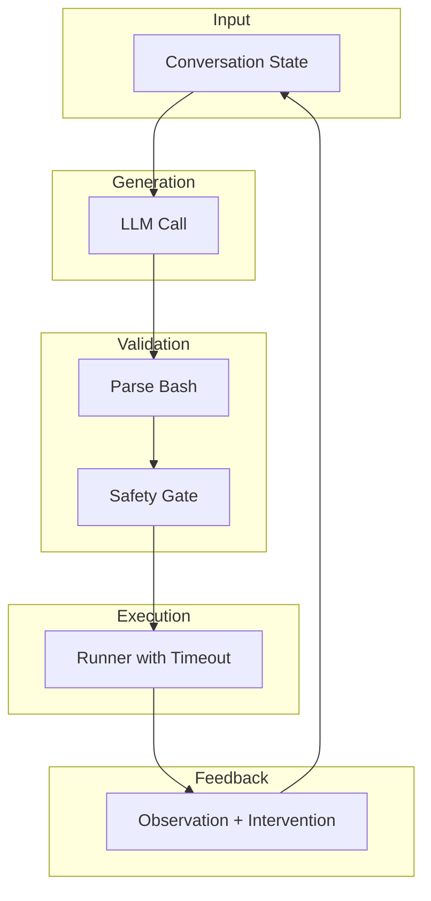
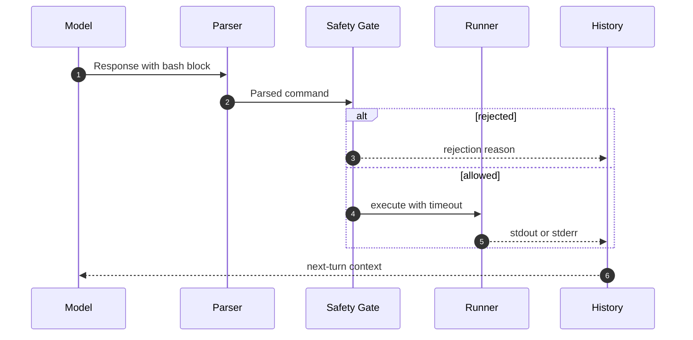

Meta bought Manus, a startup that built an agent framework for software engineering tasks. I have been following their work for a while, and I was really impressed by their demo videos. I wanted to build something similar, but I also wanted to understand how it works under the hood. So I decided to build a minimal SWE agent from scratch.

Theoretically, we can build anything with infinite time and tokens. But in practice, we have to make tradeoffs. We have to choose what to build, and how to build it.

I started this project with one very practical goal: build a coding agent I can still debug at 2 AM when my brain is half asleep.

At first glance, this can look like a waste of time. There are already many great open-source agent frameworks. But I still wanted to build one from scratch, understand every moving part, and enjoy the process.

The biggest surprise was that model prompting was not the main problem. Runtime behavior was.

---

## Why I Built It This Way

I kept repeating a few ground rules to myself:

If I could not explain a component in one minute, it was probably too early to add it. If a new feature did not solve a failure I had actually seen, it had to wait. And safety had to be practical. Not performative.

That naturally pushed the whole design toward a small ReAct loop:

Nothing clever here. One vertical loop: easy to scan, easy to reason about.

---

## The Moment I Realized Run Is the Product

At the beginning, I spent a lot of time on prompt wording, role setup, and output formatting.

It helped a little. But the painful failures came from execution: commands hanging forever, risky commands sneaking in through chained syntax, repeated mistakes, and loops that should have stopped but did not.

That was the turning point.

For an SWE-style agent, run management is not a helper utility. It is the product.

---

## Runtime Design (Small, But Intentional)

I kept the runtime as a short pipeline with clear boundaries. Each stage owns one problem.

This is not about elegance. It is about control.

### Parse step

I only execute what is inside a bash block. If parsing fails, I do not "best effort" anything.

I just return a parsing error and ask the model to try again with a valid block. That single constraint removed a lot of weird edge cases.

### Safety step

I use moderate guardrails.

Enough to block obvious dangerous commands, but not so strict that normal coding actions become impossible. The policy blocks destructive system-level commands, common bypass tricks through command chaining, and escape-like path patterns.

At the same time, it still allows standard coding operations like editing files and running tests. That tradeoff is intentional. This is an experiment project, and if the policy is too strict, you get "safe but useless."

### Run step

Each turn is single-step execution with a timeout.

No hidden background jobs. No complicated scheduler. I want one action in, one observation out.

This gives predictable failure boundaries, cleaner logs, and faster debugging when behavior gets weird.

### Failure handling step

I do not kill the run on the first error. I classify the failure and feed it back.

If the safety gate rejects a command, I explain why and ask for a different approach. If a command times out, I return that timeout as observation. If the exact same error appears three times in a row, I inject an intervention message to break the loop.

That intervention logic is tiny, but in practice it prevents a lot of useless retry cycles.

### Done step

Right now, done is intentionally simple: either the model emits `exit`, or the loop hits the max step limit.

Later, I will probably tighten this by requiring exit plus a passing test. For the MVP stage, the current rule keeps momentum without overbuilding.

```mermaid
stateDiagram-v2
    [*] --> Loop
    Loop --> Rejected: safety fail
    Rejected --> Loop: feedback added
    Loop --> Executing: command allowed
    Executing --> Loop: observation returned
    Loop --> Success: model emits exit
    Loop --> Stopped: max steps reached
    Success --> [*]
    Stopped --> [*]
```

---

## What Is Still Missing

This is still an MVP, focus on the pricipal loop and the most painful failure modes.

AAnd there are many obvious missing pieces. For example:
- No memory system. The model only sees the last turn's conversation. That makes it hard to do multi-step tasks that require long-term context.
- No tool use. The agent can only interact with the environment through bash commands. It cannot use external APIs, search the web, or call other agents.
- No state management. The agent does not have an explicit representation of the world state. It has to infer everything from the conversation history and observations.    
- No learning or adaptation. The agent does not improve over time. It does not learn from its mistakes or successes.

