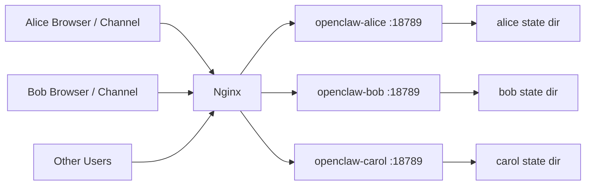

## Why I build a multi-user OpenClaw Gateway
After I got the first blood-pressure assistant running, word spread quickly in my family.

That is normal. One person needs BP tracking. Another one needs medication reminders. Someone else wants follow-up notes before doctor visits.

Then the requests started:
Can I get one too?
Can this also track my numbers?

The problem was not ideas. The problem was budget and maintenance.
I did not want to run many cloud servers.
I did not want to maintain many almost-identical agents.

So I asked a very practical question:
Can one OpenClaw Gateway serve multiple users?

## A dead end: tenant_id
My first instinct was tenant_id.

Classic multi-tenant thinking.

Give each user a tenant_id.
Namespace memory and storage by tenant_id.
Route by tenant_id.
Add prompt rules like "only respond inside current tenant scope."

OpenClaw already has session, memory, and tool context, so this looked reasonable.
Also, in many real deployments, one bot service is shared across phone, web, and desktop clients.

So I thought this would work.

It did not.

## What happened

After testing for a while, I saw the same pattern again and again.

Sometimes isolation looked fine.
Sometimes context crossed boundaries in ways it should not.

At first I blamed my own implementation.
Maybe my prompt was weak.
Maybe tenant_id was not passed correctly in one path.

I tightened everything.
The behavior improved in some happy paths.
But the core problem stayed.

Then I went back to the OpenClaw security docs and found the line that basically ended this approach:

> "A single Gateway shared by mutually untrusted people is not a recommended setup."

And this one:

> "Authenticated Gateway callers are treated as trusted operators. Session identifiers (for example sessionKey) are routing controls, not per-user authorization boundaries."

And from the official gateway security page:

> "For mixed-trust teams, split trust boundaries with separate gateways (or at minimum separate OS users/hosts)."

In plain English:
`sessionKey` and `tenant_id` are routing controls.
They are not authorization boundaries.

I was trying to force an auth boundary with business logic.
In this trust model, that is the wrong layer.

So this is not an OpenClaw bug.
This is me framing the problem incorrectly at the beginning.

**In a nutshell, OpenClaw is not designed to be a multi-tenant system**

## So what is Plan B?

Plan B is still "one machine", but not "one shared OpenClaw process".

For 5-20 people, the setup that gave me the best balance was:

One host, multiple isolated OpenClaw containers.
One container per user.
One state directory per user.
One API key budget per user (or per group policy).

This sounds simple, but that is exactly why it works.

## Why this is the practical choice for 5-20 users

I tested three options:

1. One shared gateway with logical user routing.
2. A dynamic tenant management layer (custom control plane).
3. Static multi-instance with Docker Compose.

Option 1 failed on trust boundaries.
Option 2 worked on paper, but the engineering cost was too high for a small family setup.
Option 3 was boring and solid.

That is what I picked.

## Architecture (Plan B)



Important:
each container listens on the same internal port, but is mapped to a different host port bound to loopback only.

So users never hit raw ports directly.
They only go through the reverse proxy.

## Directory layout I actually used

```bash
/opt/openclaw/
├── docker-compose.yml
├── users/
│   ├── alice/
│   │   ├── state/
│   │   └── env
│   ├── bob/
│   │   ├── state/
│   │   └── env
│   └── carol/
│       ├── state/
│       └── env
└── nginx/
    └── openclaw.conf
```

Each `env` file stores only that user's runtime config (gateway token, model key, model provider, etc.).
Each `state` folder is mounted to that user's OpenClaw home.

No shared `.openclaw` directory.

## Docker Compose (minimal for demo)

```yaml
version: "3.9"

x-openclaw-base: &openclaw-base
  image: openclaw/openclaw:latest
  restart: unless-stopped
  networks:
    - oc-net
  # Keep each instance bounded. One noisy user should not freeze others.
  cpus: 1.0
  mem_limit: 1g
  pids_limit: 256

services:
  openclaw-alice:
    <<: *openclaw-base
    container_name: oc-alice
    env_file:
      - ./users/alice/env
    volumes:
      - ./users/alice/state:/home/node/.openclaw
    ports:
      - "127.0.0.1:18781:18789"

  openclaw-bob:
    <<: *openclaw-base
    container_name: oc-bob
    env_file:
      - ./users/bob/env
    volumes:
      - ./users/bob/state:/home/node/.openclaw
    ports:
      - "127.0.0.1:18782:18789"

  openclaw-carol:
    <<: *openclaw-base
    container_name: oc-carol
    env_file:
      - ./users/carol/env
    volumes:
      - ./users/carol/state:/home/node/.openclaw
    ports:
      - "127.0.0.1:18783:18789"

networks:
  oc-net:
    driver: bridge
```

For 10 users, I just duplicate the service block.
For 20 users, still manageable if naming is clean.

## Reverse proxy (subdomain per user)

I strongly recommend subdomain routing so people do not need to remember ports.

- `alice.your-ai.com` -> `127.0.0.1:18781`
- `bob.your-ai.com` -> `127.0.0.1:18782`

Example Nginx location block:

```nginx
server {
    server_name alice.your-ai.com;

    location / {
        proxy_pass http://127.0.0.1:18781;
        proxy_set_header Host $host;
        proxy_set_header X-Forwarded-For $remote_addr;
        proxy_set_header X-Forwarded-Proto $scheme;
    }
}
```

Use TLS as usual (`certbot` or your existing ingress stack).

## What I changed from my original idea

My old idea was logical isolation in one process.
My new setup is process-level isolation by default.

Concretely:

1. Separate state directory per user.
2. Separate container per user.
3. Separate gateway auth token per user instance.
4. Optional separate model key per user (or per billing group).
5. Resource limits per container.

This removes most accidental cross-user behavior at the architecture level.

## Operational playbook

Daily operation is straightforward:

```bash
# Start all users
docker compose up -d

# Check health quickly
docker compose ps

# Tail one user's logs
docker logs -f oc-alice

# Restart only one user
docker compose restart openclaw-alice
```

Upgrade path:

```bash
docker compose pull
docker compose up -d
```

If one instance fails, others keep running.
This was a major advantage over my earlier "central manager" design.

## Security notes that matter

This is much safer than one shared process, but it is still one host.

So I treat it as strong operational isolation, not military-grade isolation.

For my use case, that is enough.
If you need stricter adversarial isolation, split by VM or by host.

Baseline hardening I kept:

- bind container ports to `127.0.0.1` only
- expose only Nginx 80/443 publicly
- strong per-instance gateway auth
- regular backups of each user's `state/`
- no shared personal accounts in runtime browser/profile

## Cost and effort reality check

For couple of  users, this is still small-team friendly.

You do not need to build a tenant scheduler.
You do not need a management API layer.
You do not need to debug a custom multi-tenant policy engine at 2 AM.

You mostly need:

- clean naming
- repeatable Compose blocks
- basic reverse proxy hygiene

That is why this became my Plan B and then my default plan.

If your target is a small trusted group, static multi-instance is not a workaround.
It is the architecture.


## In the end
OpenClaw is designed for automation and agents with a trusted single-user model. So I don't think there is a "right" way to do multi-user support. To be honest, it is really stupid, and there is collateral damage too: all the Mac minis are sold out in the market, and I have to run it in the cloud.


## References

- OpenClaw SECURITY.md: https://github.com/openclaw/openclaw/blob/main/SECURITY.md#deployment-assumptions
- OpenClaw Gateway Security: https://docs.openclaw.ai/gateway/security
- OpenClaw CLI Security: https://docs.openclaw.ai/cli/security


